# OpenSCADA Go+Vue


**SCADA-система с открытым исходным кодом**, реализованная на Go (серверная часть) и Vue.js (клиентская часть для визуализации). Предназначена для мониторинга, сбора данных, архивирования и управления промышленными процессами в реальном времени.

---

## 📋 О проекте

**SCADA** (Supervisory Control and Acquisition) — это программный комплекс для диспетчерского управления и сбора данных. Система обеспечивает взаимодействие оператора с оборудованием (датчиками, ПЛК) через современный веб-интерфейс, позволяя управлять удалёнными объектами из диспетчерской.

### Основные функции

| Функция | Описание | Статус |
|---------|----------|--------|
| Сбор данных | Непрерывный опрос датчиков и приборов через промышленные протоколы | 🟡 В процессе |
| Визуализация (HMI) | Отображение техпроцесса в виде схем, графиков и таблиц | ✅ Реализовано |
| Управление | Дистанционное воздействие на оборудование | ✅ Реализовано |
| Архивирование | Сохранение истории событий и действий оператора в PostgreSQL | ✅ Реализовано |
| Аварийная сигнализация | Мгновенное оповещение о сбоях с ведением журнала алармов | ✅ Реализовано |
| Тренды | Хранение и отображение исторических данных с агрегацией | ✅ Реализовано |

---


## 📱 Галерея экранных форм

<div style="overflow-x: auto;">
    <table style="width: 100%; border-collapse: collapse; text-align: center;">
        <tbody>
            <tr>
                <td style="border: 1px solid #ddd; padding: 15px; vertical-align: top;">
                    <b>Экран 1: ОСНОВНОЙ ЭКРАН</b><br>
                    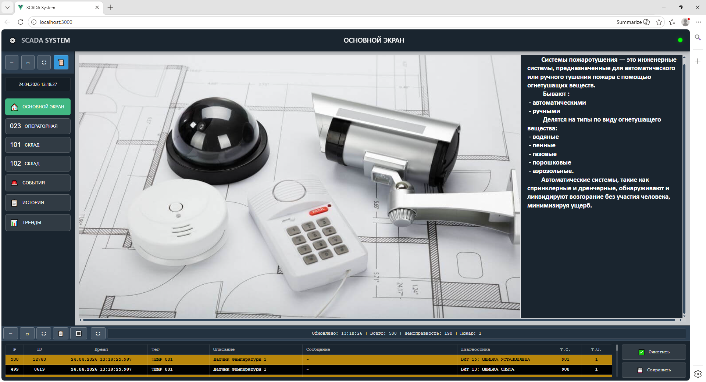
                    <br>
                </td>
                <td style="border: 1px solid #ddd; padding: 15px; vertical-align: top;">
                    <b>Экран 2: МЕСТНАЯ ОПЕРАТОРНАЯ (023)</b><br>
                    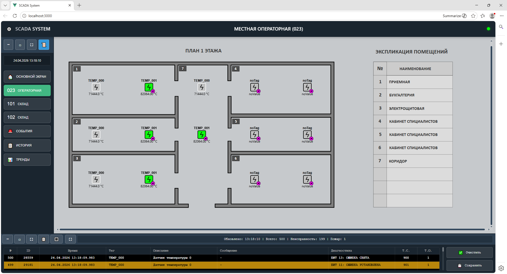
                    <br>
                </td>
            </tr>
            <tr>
                <td style="border: 1px solid #ddd; padding: 15px; vertical-align: top;">
                    <b>Экран 3: СКЛАДСКОЙ КОМПЛЕКС (101)</b><br>
                    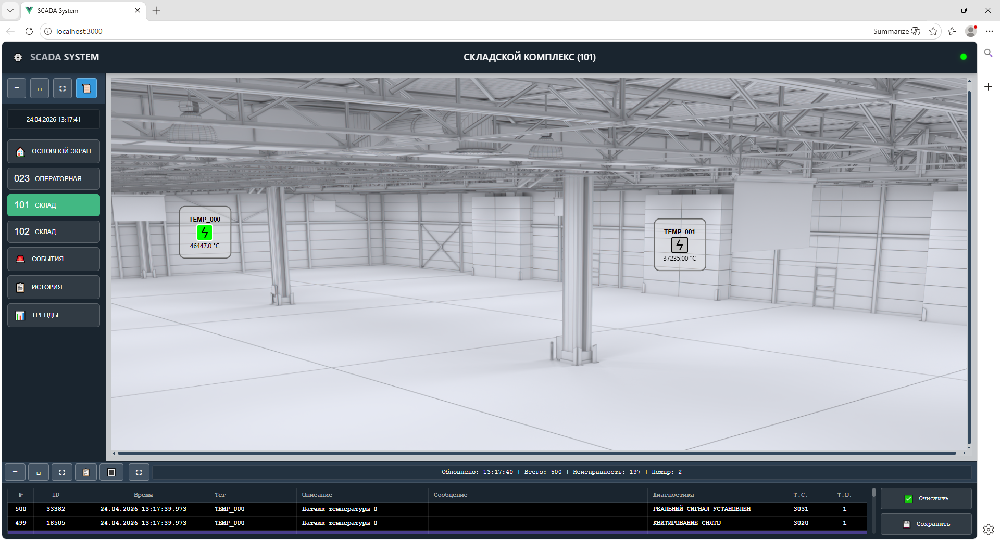
                    <br>
                </td>
                <td style="border: 1px solid #ddd; padding: 15px; vertical-align: top;">
                    <b>Экран 4: СКЛАДСКОЙ КОМПЛЕКС (102)</b><br>
                    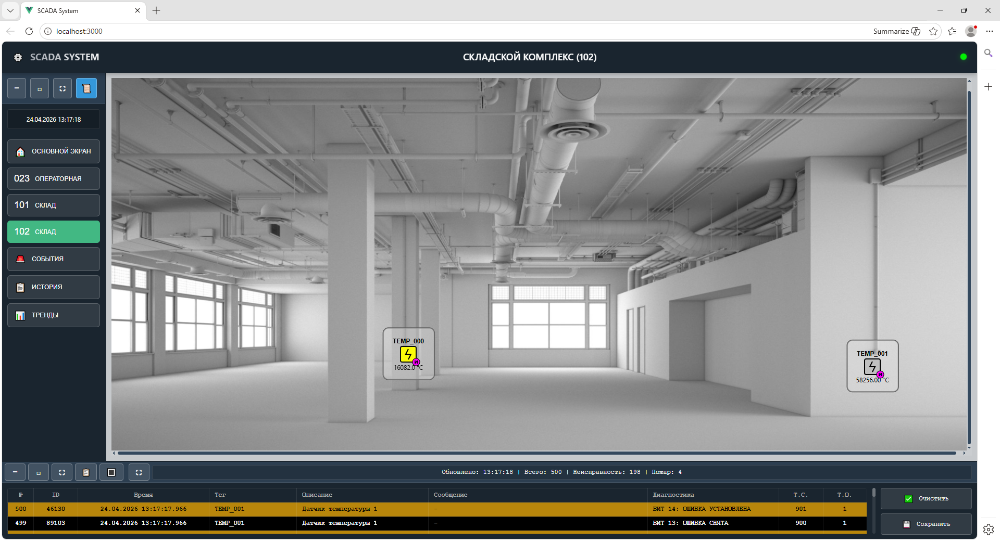
                    <br>
                </td>
            </tr>
            <tr>
                <td style="border: 1px solid #ddd; padding: 15px; vertical-align: top;">
                    <b>Экран 5: СОБЫТИЯ СИСТЕМЫ</b><br>
                    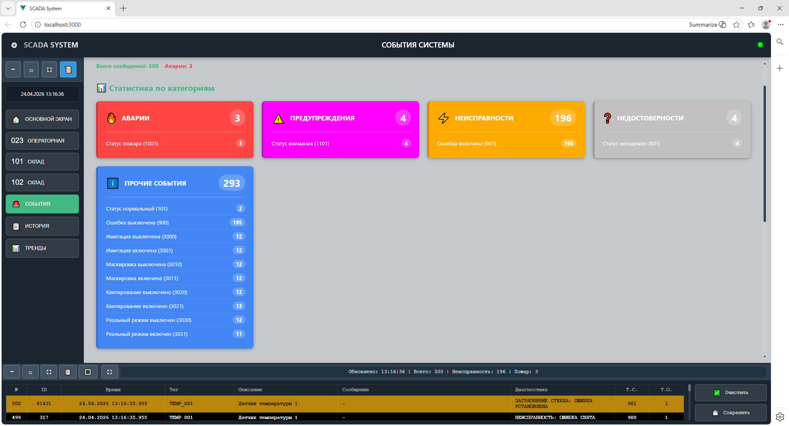
                    <br>
                </td>
                <td style="border: 1px solid #ddd; padding: 15px; vertical-align: top;">
                    <b>Экран 6: СОБЫТИЯ СИСТЕМЫ</b><br>
                    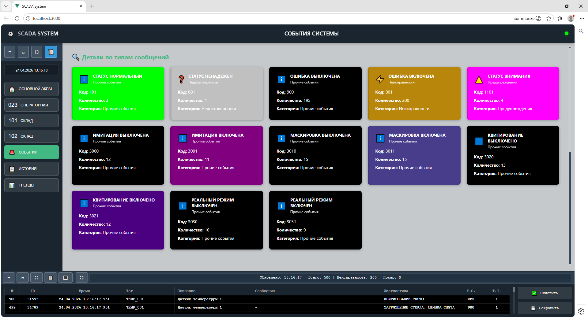
                    <br>
                </td>
            </tr>
            <tr>
                <td style="border: 1px solid #ddd; padding: 15px; vertical-align: top;">
                    <b>Экран 7: ЖУРНАЛ ИСТОРИЧЕСКИХ СОБЫТИЙ</b><br>
                    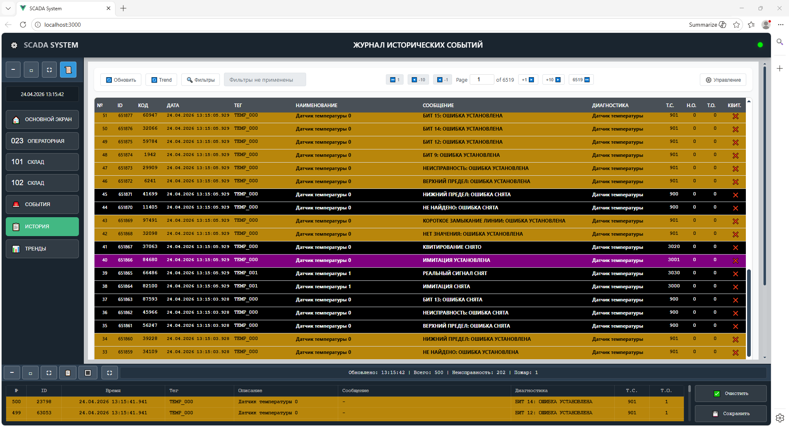
                    <br>
                </td>
                <td style="border: 1px solid #ddd; padding: 15px; vertical-align: top;">
                    <b>Экран 8: ТРЕНДЫ</b><br>
                    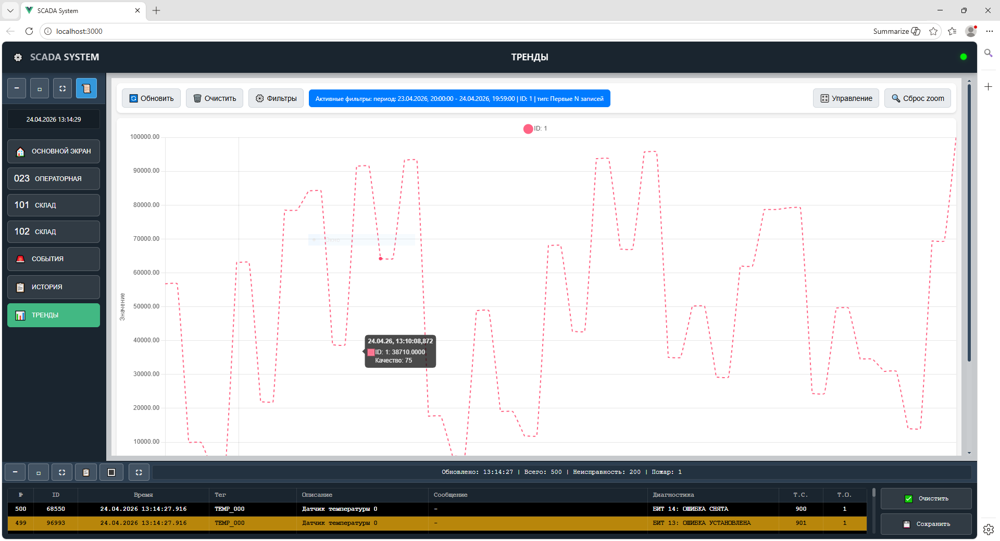
                    <br>
                </td>
            </tr>
            <tr>
                <td style="border: 1px solid #ddd; padding: 15px; vertical-align: top;">
                    <b>Экран 9: ОКНО УПРАВЛЕНИЯ</b><br>
                    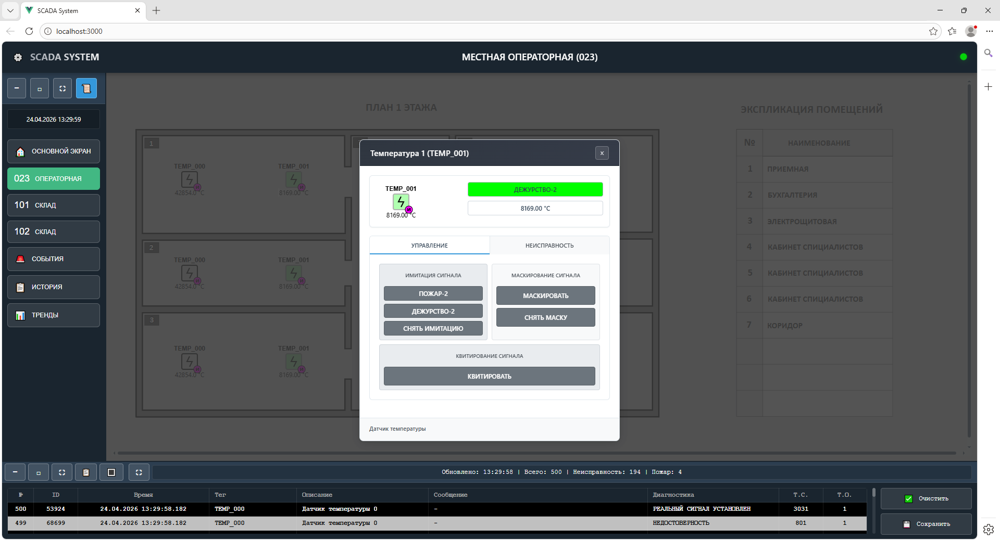
                    <br>
                </td>
                <td style="border: 1px solid #ddd; padding: 15px; vertical-align: top;">
                    <b>Экран 10: ОКНО ПОДТВЕРЖДЕНИЯ КОМАНДЫ</b><br>
                    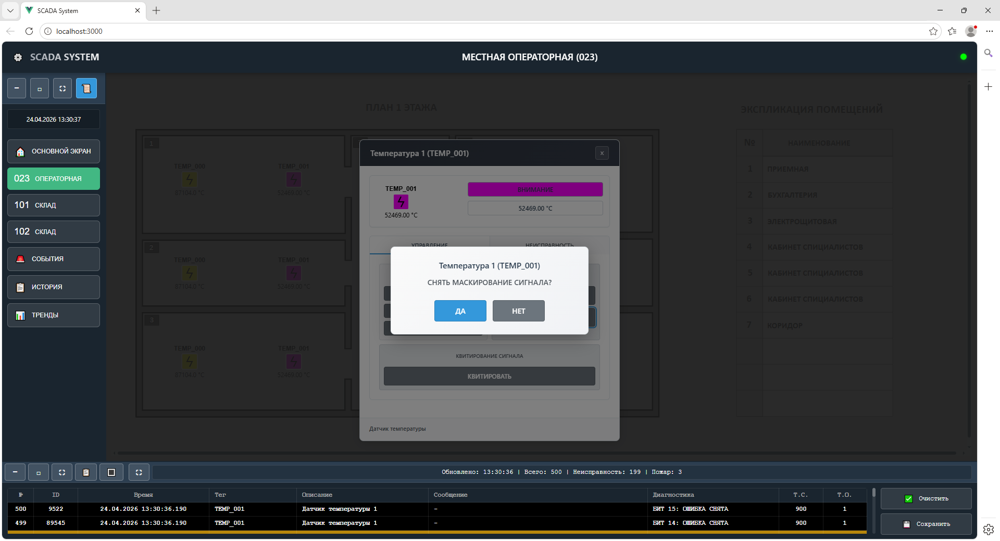
                    <br>
                </td>
            </tr>
        </tbody>
    </table>
</div>

---


## 🏗️ Архитектура системы

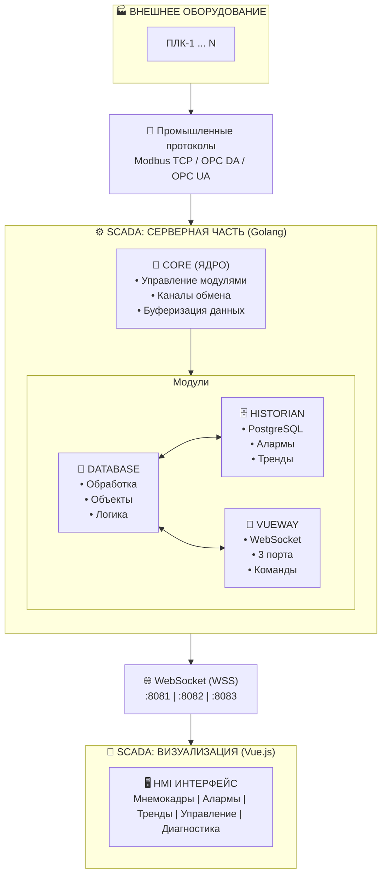

---

## 📁 Структура проекта

## 🚀 Серверная часть (Go)

Проект серверной части хранится в директории `server-system/`

```
server-system/
│
├── cmd/                          # Точки входа и конфигурация
│   ├── main.go                   # 🚀 Главный файл запуска
│   ├── config.json               # Основной конфиг программы
│   └── configs/                  # Все конфигурационные файлы
│      ├── config_database.json   # Конфиг модуля database
│      ├── config_historian.json  # Конфиг модуля historian
│      ├── config_vueway.json     # Конфиг модуля vueway
│      └── objects/               # Описание объектов (тэгов)
│          ├── database.json      # База тэгов проекта
│          ├── objdi.json         # Дискретный вход
│          ├── objsensor.json     # Датчик (аналоговый/дискретный)
│          └── trend.json         # Настройка трендов
│   
├── doc/                          # Документация и вспомогательные файлы
│   ├── img/                      # Изображения
│   ├── script/                   # Вспомогательные скрипты
│   │   └── crypto_password.go    # Шифрование паролей для конфигов
│   └── sql/                      # SQL-скрипты для PostgreSQL
│       ├── scada_alarm_001.sql   # Создание таблиц алармов
│       └── scada_trend_004.sql   # Создание партицированных таблиц трендов
│
└── pkg/                          # Основной код проекта
    │
    ├── batch/                    # 📦 Пакет упаковки и буферизации данных
    │   └── batch.go              # Буфер → группировка → отправка
    │
    ├── core/                     # 🧠 Ядро программы
    │   ├── server.go             # Инициализация модулей, каналы обмена
    │   └── error_handler.go      # Централизованная обработка ошибок
    │
    ├── modules/                        # 🧩 Модульная система
    │   │
    │   ├── database/                   # 💾 Модуль обработки данных и логики объектов
    │   │   ├── database.go             # Основная логика модуля
    │   │   ├── config.go               # Парсинг конфигурации
    │   │   ├── objects_manager.go      # Управление объектами
    │   │   ├── objects_processor.go    # Обработка логики объектов
    │   │   └── trend_processor.go      # Обработка трендов
    │   │
    │   ├── historian/                  # 🗄️ Модуль работы с PostgreSQL
    │   │   ├── historian.go            # Основная логика модуля
    │   │   ├── config.go               # Парсинг конфигурации
    │   │   ├── crypto.go               # Шифрование паролей БД
    │   │   ├── db_alarm.go             # Работа с алармами
    │   │   ├── db_alarm_processor.go   # Пакетная обработка алармов
    │   │   ├── db_trend.go             # Работа с трендами
    │   │   ├── db_trend_processor.go   # Пакетная обработка трендов
    │   │   └── types.go                # Типы данных для historian
    │   │
    │   └── vueway/                     # 🔌 Модуль взаимодействия с Vue.js
    │       ├── vueway.go               # Основная логика модуля
    │       ├── config.go               # Парсинг конфигурации
    │       ├── types.go                # Типы данных для WebSocket
    │       ├── client_manager.go       # Управление WebSocket-клиентами
    │       ├── websocket_manager.go    # Менеджер WebSocket-соединений
    │       └── websocket_connection.go # Обработка одного соединения
    │
    ├── objects/                 # 📝 Описание объектных моделей
    │   ├── types.go             # Базовые типы объектов
    │   ├── utils.go             # Вспомогательные функции
    │   ├── command.go           # Обработка команд управления
    │   ├── schemeColorText.go   # Цветовые схемы и текстовые константы
    │   └── sensor.go            # Логика объекта "Датчик"
    │
    └── types/                   # 📋 Общие типы данных (все модули)
        ├── types.go             # Основные типы (TagValue, Command и др.)
        └── types_config.go      # Типы для конфигурационных файлов
```


## Принцип работы

### 1. Ядро системы (`pkg/core/`)

**Файл:** `server.go`

Ядро отвечает за:
- Инициализацию и запуск всех модулей
- Создание буферизированных каналов для обмена данными между модулями
- Централизованную обработку ошибок
- Graceful shutdown

**Типы каналов в ядре:**

| Канал | Назначение |
|-------|------------|
| `chanSystemMess` | Диагностические сообщения от модулей |
| `chanStatus` | Статусы модулей (running, error, stopped) |

### 2. Буферизация данных (`pkg/batch/batch.go`)

**Назначение:** Упаковка данных для снижения нагрузки на систему.

**Конфигурация (в основном конфиге):**

```json
"batch_writing": {
    "buffer_size": 10000,           // Максимальный размер буфера
    "flush_interval_ms": 100,       // Интервал отправки (мс)
    "delay_between_pack_ms": 10,    // Задержка между посылками (мс)
    "max_pack_size": 5000           // Максимум данных в одной посылке
}
```

**Принцип работы:**
1. Данные попадают в буфер
2. Буфер накапливает данные до `buffer_size` или ждёт `flush_interval_ms`
3. Данные группируются в посылки по `max_pack_size`
4. Каждая посылка обрабатывается в отдельной горутине
5. Между посылками соблюдается задержка `delay_between_pack_ms`

### 3. Модуль Database (`pkg/modules/database/`)

**Назначение:** Получение данных от ПЛК, обработка данных, формирование объектной модели.

**Конфиг:** `cmd/configs/config_database.json`

**Каналы модуля:**

| Канал | Направление | Назначение |
|-------|-------------|------------|
| `ChanSystemMess` | → ядро | Диагностические сообщения |
| `ChanStatus` | → ядро | Статус модуля |
| `ChanInputGen` | ← внешний | Входные данные от ПЛК (имитатор) |
| `ChanOutputVue` | → vueway | Объектные данные для отображения |
| `ChanInputVue` | ← vueway | Данные от Vue (команды управления) |
| `ChanOutputDbsA` | → historian | Данные для сохранения алармов |
| `ChanOutputDbsT` | → historian | Данные для сохранения трендов |

**Формат входных данных (`TagValue`):**

```go
type TagValue struct {
    Tag       string      `json:"tag"`       // Идентификатор тэга
    Alias     string      `json:"alias"`     // Псевдоним (связь с объектом)
    Value     interface{} `json:"value"`     // Значение
    Quality   int         `json:"quality"`   // Качество (0=хорошее, 192=плохое)
    Timestamp time.Time   `json:"timestamp"` // Временная метка
    DataType  DataType    `json:"data_type"` // Тип данных
}
```

**Объектная модель:**

Проект использует объектовую модель — каждый объект (датчик, дискретный вход и т.д.) выполняет свою логику, формирует анимацию, генерирует алармы.

**Файлы объектов:**
- `pkg/objects/sensor.go` — логика датчика
- `cmd/configs/objects/objsensor.json` — конфигурация датчиков
- `cmd/configs/objects/database.json` — база тэгов проекта

**Принцип работы:**
1. Данные поступают по каналу `ChanInputGen`
2. По `Alias` находится объект в базе тэгов
3. Если значение изменилось — обновляется объект
4. Выполняется логика объекта (проверка алармов, формирование анимации)
5. Обновлённые данные отправляются в `vueway` (отображение) и `historian` (хранение)

### 4. Модуль Historian (`pkg/modules/historian/`)

**Назначение:** Сохранение алармов и трендов в PostgreSQL, выборка исторических данных.

**Конфиг:** `cmd/configs/config_historian.json`

**Каналы модуля:**

| Канал | Направление | Назначение |
|-------|-------------|------------|
| `ChanSystemMess` | → ядро | Диагностические сообщения |
| `ChanStatus` | → ядро | Статус модуля |
| `ChanInputDbsA` | ← database | Данные для сохранения алармов |
| `ChanInputDbsT` | ← database | Данные для сохранения трендов |
| `ChanOutputVue` | → vueway | Исторические данные для графиков и отчетов |

**Работа с алармами:**

```sql
-- Защита от дублирования
CREATE UNIQUE INDEX idx_sinkross_histmess_code_dt 
ON sinkross_histmess(code, dt);

-- Пакетная вставка
-- Выборка с пагинацией и фильтрацией
```

**Работа с трендами:**

- **Партиционирование:** ежедневное создание новых партиций
- **Индексация:** по дате/времени для быстрой выборки
- **Агрегация данных при выборке:**

| Алгоритм | Описание |
|----------|----------|
| Среднее | Берём каждую N-ю запись |
| Мин-Макс | В каждом интервале: мин и макс |
| Минимум | В каждом интервале: только минимум |
| Максимум | В каждом интервале: только максимум |
| Все записи | Первые P_limit записей |

- **Хранение:** 12 месяцев (данные старше удаляются автоматически)

### 5. Модуль VueWay (`pkg/modules/vueway/`)

**Назначение:** WebSocket-сервер для взаимодействия с Vue.js фронтендом.

**Конфиг:** `cmd/configs/config_vueway.json`

**Каналы модуля:**

| Канал | Направление | Назначение |
|-------|-------------|------------|
| `ChanSystemMess` | → ядро | Диагностические сообщения |
| `ChanStatus` | → ядро | Статус модуля |
| `ChanOutputDbs` | → database | Команды управления от Vue |
| `ChanInputDbs` | ← database | Объектные данные для Vue |

**WebSocket порты:**

| Порт | Назначение |
|------|------------|
| `8081` | Обмен объектными моделями (данные датчиков, ...) |
| `8082` | Передача управляющих команд (включить/выключить, изменить уставку) |
| `8083` | Получение исторических данных (алармы, тренды) |


---

## 🎨 Клиентская часть (Vue.js)

Проект клиентской части хранится в директории `web/`

```
web/
│
├── src/
│   │
│   ├── assets/                  # Статические ресурсы
│   │   ├── styles/              # CSS стили проекта
│   │   └── svg/                 # SVG-мнемосхемы (Inkscape)
│   │       ├── ctrl/            # Элементы управления
│   │       ├── obj/             # Объекты
│   │       └── screens/         # Мнемокадры автоматизации
│   │
│   ├── components/              # Vue-компоненты
│   │   ├── layout/              # Компоновка экрана
│   │   ├── screens/             # Экранные формы
│   │   ├── service/             # Сервисные компоненты
│   │   ├── ObjSens.vue          # Реактивный компонент датчика
│   │   ├── CtrlObjSens.vue      # Окно управления датчиком
│   │   └── CtrlConfirmation.vue # Подтверждение действий оператора
│   │
│   ├── config/                  # Конфигурация
│   │   └── screens.js           # Настройка экранов и загрузка SVG
│   │
│   ├── constants/               # Константы
│   ├── stores/                  # Pinia-хранилища
│   ├── utils/                   # Вспомогательные функции
│   ├── router/                  # Маршрутизация
│   ├── App.vue                  # Корневой компонент
│   └── main.js                  # Точка входа
│
├── index.html
├── package.json
└── vite.config.js
```

##  Принцип работы

### Загрузка мнемокадров (SVG + Vue)

**Конфигурация экранов:** `web/src/config/screens.js`

```javascript
ScreenSensors1: {
    id: 'ScreenSensors1',
    label: 'ОПЕРАТОРНАЯ',
    icon: '023',
    title: 'МЕСТНАЯ ОПЕРАТОРНАЯ (023)',
    component: ScreenSensors1,      // Vue-компонент-обёртка
    svgSchema: MnemoSchema1,        // Импортированный SVG
    objectTypes: ['obj-sensor-anchor']  // Типы якорей для замены
}
```

**Якорная система:**

В SVG-файле, нарисованном в Inkscape, добавляются специальные атрибуты:

```svg
<rect
    x="185.20834"
    y="132.29166"
    width="26.458332"
    height="26.458332"
    data-type="obj-sensor-anchor"   <!-- Тип реактивного объекта -->
    data-id="sensor_10"             <!-- Идентификатор объекта -->
/>
```

**Принцип замены:**

1. `svgScreenLoader.js` загружает SVG-схему
2. Находит все элементы с `data-type` из `objectTypes`
3. Каждый такой элемент заменяется на соответствующий Vue-компонент
4. Компонент подписывается на данные из `useObjectsStore` по `data-id`

### Хранилища данных (Pinia stores)

| Store | Назначение |
|-------|-------------|
| `websocketConnection.js` | Управление WebSocket-соединениями (3 порта) |
| `objects.js` | Хранилище текущих значений объектов (датчики, DI) |
| `alarmStore.js` | Текущие активные алармы |
| `alarmStoreHist.js` | Исторические алармы (с фильтрацией) |
| `trendStoreHist.js` | Данные трендов для графиков |
| `layout.js` | Состояние UI (масштаб, автоскролл) |

### Компоненты управления

1. **ObjSens.vue** — реактивный компонент датчика
   - Получает данные из `useObjectsStore`
   - Отображает значение, статус, цветовую индикацию
   - При клике открывает `CtrlObjSens.vue`

2. **CtrlObjSens.vue** — окно управления датчиком
   - Отображает подробную информацию
   - Кнопки управления (если объект управляемый)
   - Вызывает `CtrlConfirmation.vue` для подтверждения

3. **CtrlConfirmation.vue** — окно подтверждения действий
   - Запрашивает подтверждение опасных действий
   - Отправляет команду через WebSocket (порт 8082)

---

## 🗄️ База данных PostgreSQL

### Таблицы алармов (`scada_alarm_001.sql`)

```sql
-- Основная таблица сообщений
sinkross_histmess (
    id         BIGSERIAL PRIMARY KEY,
    code       VARCHAR(50),   -- Код аларма
    msg        TEXT,          -- Текст сообщения
    type       INTEGER,       -- Тип (авария/предупреждение)
    status     INTEGER,       -- Статус (активен/подтверждён/снят)
    dt         TIMESTAMP,     -- Время события
    user_name  VARCHAR(100),  -- Пользователь
    ...
)

-- Уникальный индекс для защиты от дублирования
CREATE UNIQUE INDEX idx_sinkross_histmess_code_dt 
ON sinkross_histmess(code, dt);
```

### Таблицы трендов (`scada_trend_004.sql`)

```sql
-- Партиционированная таблица
sinkross_trend_%Y_%m_%d (
    id         BIGSERIAL,
    tag        VARCHAR(50),   -- Идентификатор тэга
    value      DOUBLE,        -- Значение
    quality    INTEGER,       -- Качество
    dt         TIMESTAMP      -- Время записи
) PARTITION BY RANGE (dt);

-- Индекс для быстрой выборки
CREATE INDEX idx_sinkross_trend_tag_dt 
ON sinkross_trend_{partition} (tag, dt);
```

---

## 🚀 Запуск проекта

### Требования

| Компонент | Версия |
|-----------|--------|
| Go | 1.21+ |
| Node.js | 16+ |
| PostgreSQL | 14+ |
| Docker | (опционально) |

### 1. Настройка базы данных

```bash
# Создание базы данных
psql -U postgres -c "CREATE DATABASE dbScada;"
psql -U postgres -c "CREATE DATABASE dbTrend;"

# Выполнение скриптов
psql -U postgres -d scada -f server-system/doc/sql/scada_alarm_001.sql
psql -U postgres -d scada -f server-system/doc/sql/scada_trend_004.sql
```

### 2. Настройка конфигурации

**Заполнить конфиги:** `server-system/cmd/configs/`

### 3. Запуск серверной части

```bash
cd server-system/cmd

# Запуск
go run main.go

```

### 4. Запуск клиентской части

```bash
cd server-system/web

# Установка зависимостей
npm install

# Режим разработки
npm run dev

# Сборка для production
npm run build
```

---

## 📡 WebSocket API
Пример запросов/ответов, отличаются от оригинальных. Обмен данными происходит в упакованном  виде.

### Порт 8081 — объектные данные

**От сервера к клиенту:**

```json
{
    "type": "object_update",
    "data": {
        "sensor_10": {
            "value": 25.5,
            "quality": 0,
            "status": "normal",
            "timestamp": "2026-01-15T10:30:00Z"
        }
    }
}
```

### Порт 8082 — управляющие команды

**От клиента к серверу:**

```json
{
    "command": "set_value",
    "target": "sensor_10",
    "value": 30.0,
    "user": "operator"
}
```

### Порт 8083 — исторические данные

**Запрос от клиента:**

```json
{
    "type": "get_trends",
    "tags": ["sensor_10", "sensor_11"],
    "from": "2026-01-01T00:00:00Z",
    "to": "2026-01-15T23:59:59Z",
    "aggregation": "min_max",
    "limit": 1000
}
```

**Ответ сервера:**

```json
{
    "sensor_10": [
        {"dt": "2026-01-01T00:00:00Z", "min": 20.5, "max": 30.2},
        {"dt": "2026-01-02T00:00:00Z", "min": 21.0, "max": 31.5}
    ]
}
```

---


## 📄 Лицензия

MIT License.


## 📧 Контакты

**Автор:** PolinaSvet  
**GitHub:** [github.com/PolinaSvet](https://github.com/PolinaSvet)

---

*Система находится в активной разработке.*

